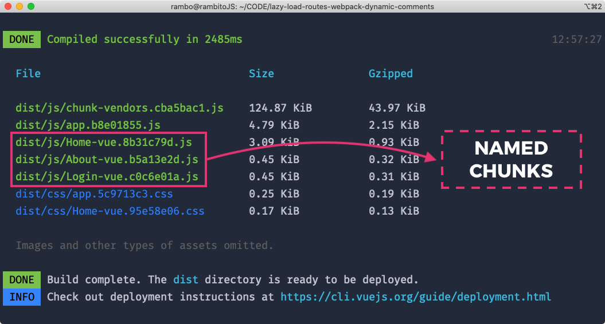

# Lazy load routes & webpack dynamic comments

Hi! My name is [Jorge Baumann](https://twitter.com/baumannzone) and I welcome you to this new vue tip 🖖.

In this tip, I would like to share how I usually work when I have to deal with routes and lazy load.

Most probably, you are used to see Vue routes like this:

```javascript
import Vue from 'vue'
import VueRouter from 'vue-router'

import Home from '../views/Home.vue'
import About from '../views/About.vue'
import Login from '../views/Login.vue'

Vue.use(VueRouter)

const routes = [
  { path: '/', name: 'Home', component: Home },
  { path: '/about', name: 'About', component: About },
  { path: '/login', name: 'Login', component: Login }
]

const router = new VueRouter({
  routes
})

export default router
```


Or maybe this way, with the routes loaded asynchronously and specified chunk name:

```javascript
const routes = [
  {
    path: '/',
    name: 'Home',
    component: () => import(/* webpackChunkName: "Home" */ '../views/Home.vue')
  },
  {
    path: '/about',
    name: 'About',
    component: () => import(/* webpackChunkName: "About" */ '../views/About.vue')
  },
  {
    path: '/login',
    name: 'Login',
    component: () => import(/* webpackChunkName: "Login" */ '../views/Login.vue')
  }
]
```

This way it's really ok and it has nothing wrong. However, for most cases, I prefer to use a different system instead of using the "normal" approximation. 

As you can see, there are some repetitive patterns. Since you are an awesome developer, you can use an `array` with the *route options* and then iterate with a `map()` function to avoid doing repetitive tasks.

Something like this:

```javascript
const routeOptions = [
  { path: '/', name: 'Home' },
  { path: '/about', name: 'About' },
  { path: '/login', name: 'Login' }
]

const routes = routeOptions.map(route => {
  return {
    ...route,
    component: () => import(`@/views/${route.name}.vue`)
  }
})

const router = new VueRouter({
  routes
})
```

🤩 Looks nice, isn't it?

We have reduced the use of the `component` key by using the route `name` as param in the `import` function. 

But.. what happens if you want set the *chunk name*? 
I'm not a scientist, but as far as my knowledge reaches, you can't have dynamic comments in javascript. So, we are sacrificing comments (`webpackChunkName`) in favor of having to write less code. It's up to you.

Joke. **Webpack to the rescue!** As of webpack `2.6.0` , the placeholders `[index]` and `[request]` are supported, meaning you can set the name of the generated chunk thus:

```javascript
// ...

const routeOptions = [
  { path: '/', name: 'Home' },
  { path: '/about', name: 'About' },
  { path: '/login', name: 'Login' }
]

const routes = routeOptions.map(route => {
  return {
    ...route,
    component: () => import(/* webpackChunkName: "[request]" */ `../views/${route.name}.vue`)
  }
})

const router = new VueRouter({
  routes
})
```

👌 Very nice! Now you have all the power, dynamically loaded routes with named chunks. You can check it out by running `npm run build` in your terminal:



As you see, it's extremely easy implement this in your vue.js applications. Now it's your turn. Start to improve your `router.js` file by using this awesome tip.


---


That's all. Thanks for reading. Share it if you liked it. And Alex, thank you for letting me write my first Vue tip. 🤘

My name is [Jorge Baumann](https://instagram.com/baumannzone) and I'm a fullstack developer, actually living in Madrid. I'm into javascript, HTML, CSS, node.js, vue.js, firebase, Web APIs, etc. 
I have a beautiful dog called Rambo, who honors my youtube (newly released) channel.

[](https://www.youtube.com/channel/UCTTj5ztXnGeDRPFVsBp7VMA)

I usually tweet web-dev related stuffs and I'm continuously creating software on github. I write blog posts on Medium (*spanish*) and Dev.to (*english*). 

- Twitter: [@baumannzone](https://twitter.com/baumannzone)
- Instagram: [baumannzone](https://instagram.com/baumannzone)
- Github: [baumannzone](https://github.com/baumannzone)
- Dev.to: [baumannzone](https://dev.to/baumannzone)
- Youtube: [Rambito JS](https://www.youtube.com/channel/UCTTj5ztXnGeDRPFVsBp7VMA)
- Medium: [@baumannsito](https://medium.com/@baumannsito/testing-con-javascript-tutorial-bb85745f2b6e)
